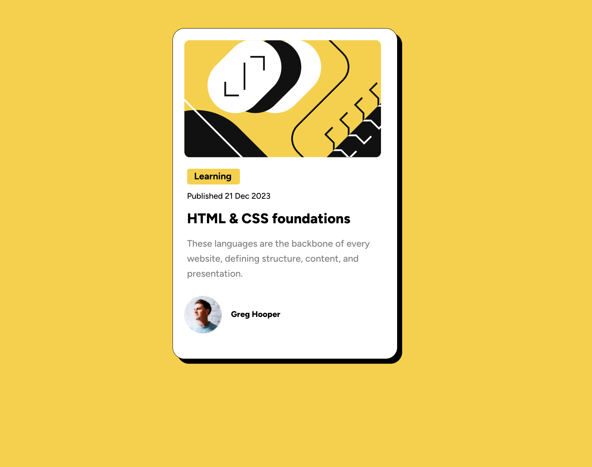

## Table of contents

- [Overview](#overview)
  - [The challenge](#the-challenge)
  - [Screenshot](#screenshot)
  - [Links](#links)
- [My process](#my-process)
  - [Built with](#built-with)
  - [What I learned](#what-i-learned)
  - [Continued development](#continued-development)

## Overview

### The challenge

Create blog post with css property for hovering over a link.

### Screenshot

### Links

- Solution URL: [Add solution URL here](https://your-solution-url.com)
- Live Site URL: [Add live site URL here](https://your-live-site-url.com)

## My process

### Built with

- Semantic HTML5 markup
- CSS custom properties
- Flexbox
- Integrated mobile view

### What I learned

This project was fast, but I deepened my knowledge of where to use Flexbox properties. I used to place them everywhere and question myself, why nothing works like I want to. With this simple project, I understood fully, how to use Flexbox. Also huge achievement for me is the proper structure of HTML document. Deepened my understanding of classes
THE BIGGEST ACHIEVEMENT SO FAR IS FOR SURE THAT FINALLY I KNOW HOW TO LINK CSS DOCS WITHOUT PROBLEMS !!! <3

### Continued development

In the future i will deepen my knowledge of flexbox and responsive design
